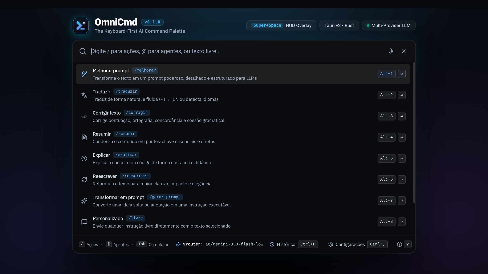

<div align="center">



# OmniCmd

### The Keyboard-First AI Command Palette for Power Users & Developers

<p align="center">
  <a href="https://github.com/themistrinel/omnicmd/releases">
    
  </a>
  <a href="https://github.com/themistrinel/omnicmd/blob/master/LICENSE">
    
  </a>
  
  
  
</p>

<p align="center">
  <a href="#-key-features">Key Features</a> •
  <a href="#-quick-start">Quick Start</a> •
  <a href="#-keyboard-shortcuts">Shortcuts</a> •
  <a href="#-multiplatform-builds">Multiplatform Builds</a> •
  <a href="#-support--donations">Support &amp; Donations</a>
</p>

</div>

---

## ⚡ What is OmniCmd?

**OmniCmd** is a blazingly fast, lightweight, keyboard-driven AI command palette that stays out of your way until you need it. 

Instead of juggling browser tabs, copy-pasting into chat windows, and breaking your train of thought, invoke OmniCmd with a single keystroke (`Super+Space`), apply any AI prompt action to your active clipboard content, and immediately paste the result back into your IDE, terminal, or document.

Built with **Tauri v2**, **Rust**, and **React 19**, OmniCmd consumes a fraction of the RAM required by typical Electron apps while delivering instantaneous startup and native OS window integration.

---

## 🚀 Key Features

* ⚡ **Zero-Latency HUD Overlay**: Floating, borderless interface that opens over any window with native acrylic/blur styling.
* 📋 **Automatic Clipboard Context**: Captures your selected text or snippet automatically upon launch.
* 🔀 **Multi-Provider Architecture**: Connect seamlessly to **9router**, **OpenAI**, **Ollama**, or custom local LLM endpoints with quick switching (`/provider`).
* 🎭 **Instant Persona Presets**: Shift reasoning styles on the fly (`Alt+1..6`) for code review, executive summaries, creative brainstorming, or strict conciseness.
* ⌨️ **Vim & Numbered Navigation**: Execute actions instantly with `#1..9`, navigate with `Ctrl+j / Ctrl+k` or arrow keys, and inspect tokens with zero mouse interaction.
* 📦 **Local & Private SQLite Database**: Full history of generations, custom prompts, and appearance settings saved locally on your machine.
* 🎛️ **Background Daemon & System Tray**: Persistent background runner that keeps your hotkey responsive at all times without taking window focus when idle.

---

## ⌨️ Keyboard Shortcuts

| Shortcut | Action | Description |
| :--- | :--- | :--- |
| <kbd>Super</kbd> + <kbd>Space</kbd> | **Toggle HUD** | Shows or hides the OmniCmd command window |
| <kbd>Enter</kbd> | **Execute Selected** | Runs the highlighted action against active context |
| <kbd>#1</kbd> .. <kbd>#9</kbd> | **Direct Action Run** | Immediately triggers the corresponding item in the list |
| <kbd>Ctrl</kbd> + <kbd>j</kbd> / <kbd>k</kbd> | **Vim Navigation** | Moves selection down / up |
| <kbd>Alt</kbd> + <kbd>1..6</kbd> | **Persona Switch** | Cycles between Developer, Concise, Creative, etc. |
| <kbd>/provider</kbd> | **Cycle Provider** | Toggles between 9router, Omni, and Custom endpoints |
| <kbd>/history</kbd> | **Open History** | Searches past queries, tokens, and outputs |
| <kbd>/settings</kbd> | **Settings Modal** | Configures models, temperatures, and API endpoints |
| <kbd>Esc</kbd> | **Dismiss / Back** | Clears current view or hides the window |

---

## 📦 Downloads & Releases

Pre-compiled binary packages are automatically built on every push to `main` and release tags for all major desktop platforms:

| OS | Architecture | Package Format | Download Link |
| :--- | :--- | :--- | :--- |
| **Linux (Arch / Hyprland)** | `x86_64` | Native bin, `.AppImage`, `.deb` | [Quick Install](#-arch-linux--hyprland-setup) / [Releases](https://github.com/themistrinel/omnicmd/releases) |
| **Windows** | `x64` | `.msi`, `.exe` installer | [GitHub Releases](https://github.com/themistrinel/omnicmd/releases) |
| **macOS** | Universal (`arm64` & `x86_64`) | `.dmg` | [GitHub Releases](https://github.com/themistrinel/omnicmd/releases) |

---

## 🐧 Arch Linux & Hyprland Setup

O OmniCmd possui instalador oficial dedicado para **Arch Linux** e o compositor Wayland **Hyprland**, garantindo adaptação nativa para que a janela se comporte como uma paleta Raycast/Spotlight (flutuante, sem bordas tiling indesejadas, foco instantâneo e atalhos customizáveis).

### ⚡ 1-Liner Quick Install (Sem clonar repositório)
Execute diretamente em qualquer terminal sem precisar clonar ou instalar o git:
```bash
curl -fsSL https://raw.githubusercontent.com/themistrinel/omnicmd/master/install.sh | bash
```
*(ou se já clonou o repositório localmente: `./install.sh` ou `./scripts/install-arch-hyprland.sh`)*

### O que o instalador faz automaticamente:
1. **Sem Git Clone**: Baixa os arquivos necessários e o binário oficial otimizado direto do GitHub Releases.
2. **Dependências do Arch**: Instala via pacman `webkit2gtk-4.1`, `libayatana-appindicator`, `openssl`, `wl-clipboard` (área de transferência nativa Wayland), `librsvg`, `jq` e `curl`.
3. **Binários e Atalhos de Sistema**: Instala `omnicmd`, `omnicmd-toggle` e `omnicmd-update` em `~/.local/bin/` e registra o lançador desktop `.desktop` com ícone oficial.
4. **Regras de Janela no Hyprland (`~/.config/hypr/omnicmd.conf`)**:
   - Flutuação (`float`), centralização (`center`), tamanho fixo `800x560`
   - Remoção de bordas e decoração tiling (`noborder`)
   - Manutenção de foco e fixação sobre qualquer workspace (`stayfocused`, `pin`)
   - Animação rápida fluida popin 95%
5. **Atalhos / Shortcuts no Hyprland**:
   - `SUPER + SPACE`: Alterna visibilidade da paleta instantaneamente via `omnicmd-toggle`
   - `SUPER + SHIFT + SPACE`: Abre/recarrega nova sessão
6. **Atualizações Contínuas com 1 Comando**:
   - Cria o utilitário `omnicmd-update` no terminal para você atualizar o OmniCmd direto das novas releases do GitHub sempre que quiser:
   ```bash
   omnicmd-update
   ```
   - O OmniCmd também verifica silenciosamente se há novas versões e oferece atualização automática in-app.
7. **Desinstalação Limpa com 1 Comando**:
   - Para remover completamente todos os arquivos, regras do Hyprland e binários:
   ```bash
   omnicmd-uninstall
   # Ou para limpar também o histórico SQLite e configurações locais:
   omnicmd-uninstall --purge
   ```
   *(ou sem clonar o repositório: `curl -fsSL https://raw.githubusercontent.com/themistrinel/omnicmd/master/uninstall.sh | bash`)*

---

## 🛠️ Building from Source

### 1. Prerequisites
* **Node.js** (v20+) & **pnpm** (v9+)
* **Rust toolchain**: `curl --proto '=https' --tlsv1.2 -sSf https://sh.rustup.rs | sh`
* *(Linux only)*: GTK & WebKit development packages:
  ```bash
  sudo apt-get install -y libwebkit2gtk-4.1-dev libayatana-appindicator3-dev librsvg2-dev libssl-dev build-essential
  ```

### 2. Clone & Run Development Server
```bash
git clone https://github.com/themistrinel/omnicmd.git
cd omnicmd

# Install dependencies
pnpm install

# Start development HUD with hot-reload
pnpm tauri dev
```

### 3. Compiling Release Packages Locally
We provide a turnkey multiplatform build helper:
```bash
# Verify typecheck and Rust compilation:
./scripts/build-local.sh check

# Build full installers/binaries:
./scripts/build-local.sh bundle
```

---

## 💖 Support & Donations

OmniCmd is a free, open-source project created and maintained by independent developers. If OmniCmd saves you time and boosts your day-to-day coding productivity, please consider supporting continued development via **Pix**!

<p align="center">
  
</p>

### 🔑 Chave Pix (Aleatória)
```text
698b86a2-3f72-4be7-ab3e-f838522a41e2
```

### 📋 Pix Copia e Cola
```text
00020126580014br.gov.bcb.pix0136698b86a2-3f72-4be7-ab3e-f838522a41e25204000053039865802BR5907OmniCmd6009SAO PAULO62070503***63041D7E
```

---

## 📄 License

Distributed under the **MIT License**. See [`LICENSE`](LICENSE) for more information.
